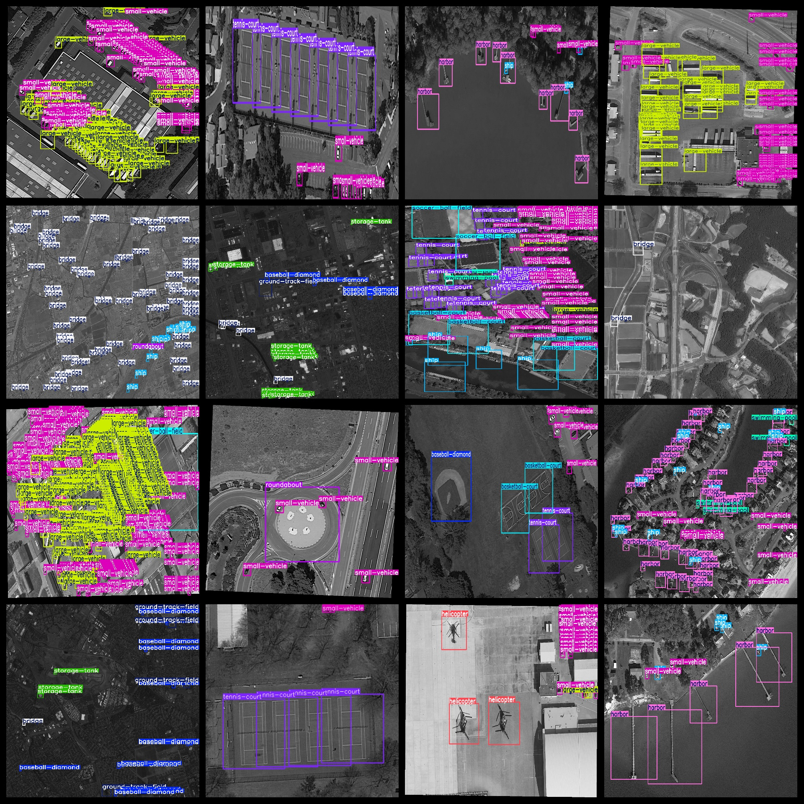
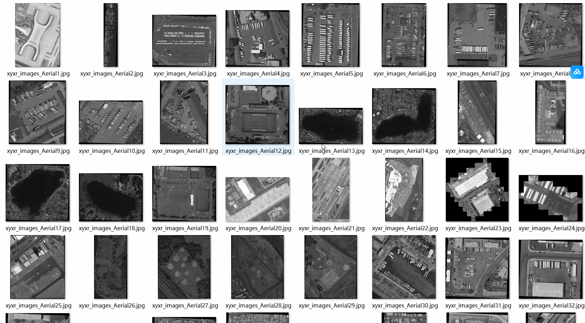

# Aerial Ground Multi-Object Detection Dataset 1713 images, 16 classes, VOC+YOLO format

The dataset includes 1713 images in the VOC+YOLO format, organized into three folders: JPEGImages, Annotations, and labels. The JPEGImages folder contains a total of 1713 jpg images, the Annotations folder contains a total of 1713 xml files, and the labels folder contains a total of 1713 txt files.

The dataset consists of 16 classes, including baseball diamond, basketball court, bridge, container crane, ground track field, harbor, helicopter, large vehicle, plane, roundabout, ship, small vehicle, soccer ball field, storage tank, swimming pool, and tennis court.

The number of bounding boxes (yolo format) for each class varies from 596 to 26032, with an average of approximately 1000 bounding boxes per class.

The image resolution is generally good, with most having a resolution of 768x1024 pixels.

There are no enhancements applied to the images.

The shape of the bounding boxes used for target detection is rectangular, which facilitates accurate recognition of objects.

This dataset does not guarantee the accuracy or precision of any trained models or weight files; it only provides accurate and reasonable annotations.

Note: There is no specific note regarding important details such as data preprocessing steps, model architectures, or training configurations.

## Images

---

Here is a pay link on Stripe (https://buy.stripe.com/3cs8yP7sY87d0vu9AB). Please contact me lonlonago@foxmail.com after funding $89, and I will send you a complete data files, thank you!

